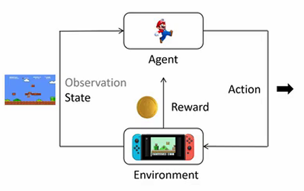

# hand-on-rl

我们以超级马里奥游戏为例，逐步了解强化学习中涉及的基本概念：

- 环境 (Environment)：环境是智能体所处的外部系统，它负责产生当前的状态，接收智能体的动作并返回新的状态和对应的奖励。环境的作用相当于模拟现实中的条件和反应规则，智能体只能通过与环境的交互来了解其动态变化。以超级马里奥游戏为例，环境包括玩家看到的游戏画面和后台程序逻辑。环境控制了游戏进程，例如生成敌人、提供奖励以及决定游戏何时结束。智能体并不知道环境的内部实现细节，只能依靠输入输出规则与环境互动。
- 智能体 (Agent)：智能体是强化学习中的决策者，它会不断地观察环境的状态，并根据其策略选择动作。智能体的目标是通过选择一系列最优动作，获得尽可能多的累积奖励。
- 状态 (State)：状态是环境在特定时刻的全面描述。对于智能体而言，状态是决策的基础，它包含了关于当前环境的所有重要信息。
- 动作 (Action)：动作是智能体对当前状态的反应。基于当前的状态，智能体使用其策略函数来决定下一步要采取的动作。例如，在超级玛丽中，动作可以包括“向左移动”、“向右移动”和“跳跃”。动作可以是离散的（如跳跃或移动的方向选择）或者连续的（如机器手臂在三维空间中的移动角度）。强化学习的核心在于使智能体学会如何在每个状态下选择最优的动作，从而最大化回报。
- 奖励 (Reward)：奖励是环境对智能体执行动作后给予的反馈。奖励可以是正的（奖励）或者负的（惩罚）。例如，在超级马里奥游戏中，吃到金币可以获得正奖励（例如 +10 分），而碰到敌人会得到负奖励（例如 -100 分）。
- 动作空间 (Action Space)：指智能体在当前状态下可以选择的动作集合。
- 轨迹 (Trajectory)：轨迹（又称为回合或episode）是指智能体在一次完整的交互过程中经历的一系列状态、动作和奖励的序列。轨迹通常表示为 $\tau = (s_0, a_0, s_1, a_1, \dots, s_T)$，其中 $s_i$ 表示第 $i$ 时刻的状态，$a_i$ 表示智能体在状态 $s_i$ 下选择的动作。。比如大语言模型生成时，它的状态就是已经生成的token序列。当前的动作是生成下一个token。当前token生成后，已生成的序列就加上新生成的token成为下一个状态。
- 回报 (Return Reward)：表示从当前时间步开始直到未来的累积奖励和，通常用符号 $G_t$ 表示：$G_t = R_{t+1} + R_{t+2} + \dots + R_T$。回报的定义是智能体决策的重要依据，因为强化学习的目标是训练一个策略，使得智能体在每个状态下的期望回报最大化。

    

## 强化学习的目标

在强化学习中，目标是训练一个策略 $\pi_\theta(a|s)$，其中 $\theta$ 是策略网络的参数，使得期望的累积回报最大化。可以用数学表达如下：

$$
J(\theta) = \mathbb{E}_{\tau \sim p_\theta} \left[ R(\tau) \right]
$$

其中：

- $\tau = (s_0, a_0, s_1, a_1, \dots, s_T)$ 表示轨迹（trajectory）。
- $R(\tau)$ 是轨迹 $\tau$ 中的累积回报，即从初始状态到终止状态所有奖励的累加。
- $p_\theta$ 表示在策略 $\pi_\theta$ 下采样轨迹 $\tau$ 的概率分布。

为了最大化回报，可以通过梯度上升的方法对神经网络参数进行优化。梯度上升的更新规则为：

$$
\nabla_\theta J(\theta) = \mathbb{E}_{\tau \sim p_\theta} \left[ \nabla_\theta \log p_\theta(\tau) R(\tau) \right]
$$

通过进一步数学推导，可以得到更易计算的形式：

$$
\nabla_\theta J(\theta) \approx \frac{1}{N} \sum_{i=1}^{N} \nabla_\theta \log p_\theta(\tau_i) R(\tau_i)
$$